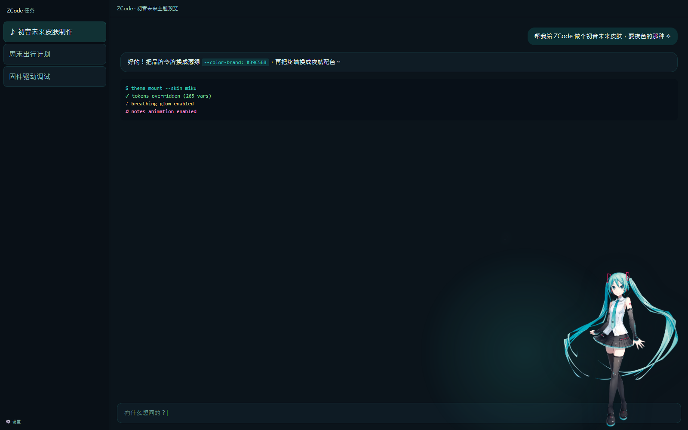
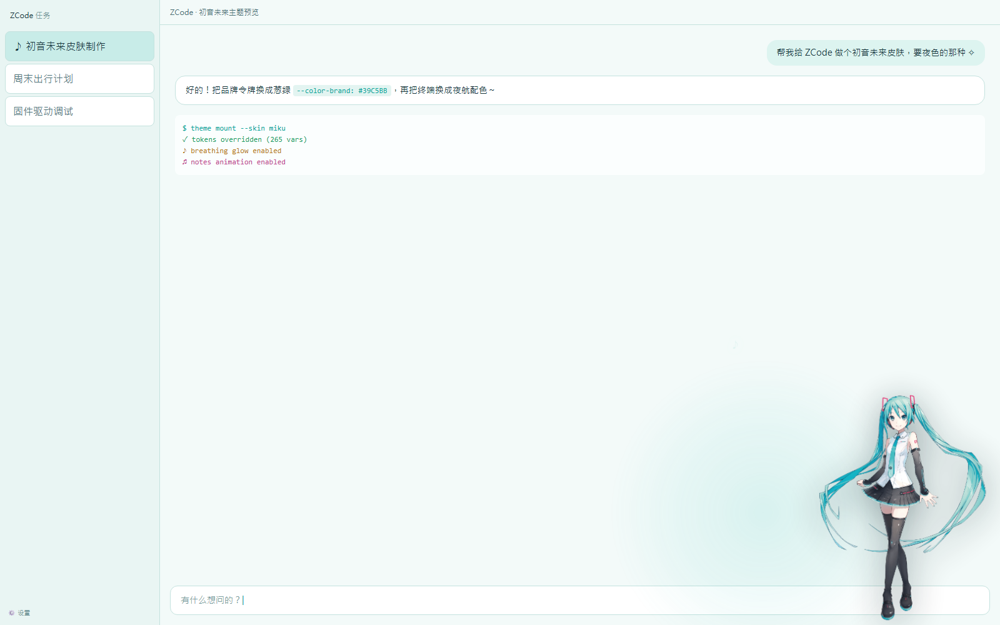

# ZCode 初音未来主题 (Hatsune Miku Skin for ZCode)

非官方、非商业的粉丝二创主题。通过 Chromium 调试端口（仅 127.0.0.1 回环 + 固定高位端口）向 ZCode 桌面端注入 CSS，实现日夜双形态换肤 + 初音未来立绘 + 呼吸光效 + 音符动效。**不修改任何程序文件，卸载即恢复原版。**





- 适配版本：本机 ZCode 3.11.2.6792（Electron 41）实测可用；其它版本未验证
- 本仓库即主题完整源码，克隆到任意目录即可使用（脚本均为相对路径定位）

## 快速使用

1. 克隆本仓库到本地任意目录；
2. 确认已安装 Node.js（注入器用），ZCode 安装路径会被自动探测；
3. 双击 `mount.cmd` 挂载（应用会带调试端口重启一次，先保存工作）；
4. 想要开机免操作自动挂载：运行 `setup-autostart.ps1`（给快捷方式加参数 + 建登录任务），之后正常打开 ZCode 主题会在窗口出现后约 3 秒内自动附上。

| 操作 | 方式 |
|---|---|
| **手动给当前实例挂载** | 双击 `mount.cmd`（应用已在跑但没有端口时，会重启一次） |
| **后台静默挂载** | `mount-hidden.vbs`（无任何窗口，供计划任务/脚本调用） |
| **临时恢复原版** | 双击 `unmount.cmd`（下次正常打开会再次自动挂上） |
| **彻底移除自启** | 运行 `teardown-autostart.ps1`（还原快捷方式、删除自启、停止注入器） |
| **重新启用自启** | 运行 `setup-autostart.ps1` |

窗口宽度 <1020px 或高度 <620px 时立绘自动隐藏，不影响小窗使用。

运行过程会在脚本目录生成 `mount.log`、`state.json`、`verification.png`（挂载自检截图），均为本地运行产物，不入库。

## 文件说明

```
zcode-miku-theme/
├─ mount.cmd / mount.ps1                挂载入口（关应用→带调试端口重启→注入→自检截图）
├─ unmount.cmd / unmount.ps1            卸载入口（停注入器→重启应用→恢复原版）
├─ mount-hidden.vbs                     后台静默挂载（无窗口）
├─ auto-mount.cmd                       延时挂载包装（可带延迟秒数参数）
├─ setup-autostart.ps1                  一键配置开机自启（快捷方式加参数 + 登录任务）
├─ teardown-autostart.ps1               彻底移除自启
├─ patch-public-shortcuts.ps1           给所有用户级快捷方式加挂载参数（需管理员）
├─ theme/miku-theme.css                 主题本体（覆盖 ZCode 的 --color-* 设计令牌，265 个变量体系）
├─ scripts/miku-inject.mjs              CDP 注入器（常驻巡检，页面刷新/新窗口自动补挂；应用退出后自动结束）
├─ assets/miku-v4x.png                  初音未来立绘（官方画师 iXima 绘制的 V4X 立绘，透明底，来自萌娘百科）
└─ mock/shot-dark.png · shot-light.png  主题预览截图（本地 mock 页面渲染）
```

## 工作原理与安全边界

1. **注入方式**：`mount.ps1` 以 `--remote-debugging-port=<固定端口> --remote-allow-origins=*` 重启 ZCode，注入器通过 CDP 的 `CSS.createStyleSheet` 注入主题（不受页面 CSP 限制），并每 10 秒巡检补挂（应对页面刷新）。这与嘉然多应用启动器给 ZCode 挂载的思路一致。
2. **只作用于应用自身页面**：注入器按 URL 匹配 `index.html`（应用渲染层），**不会**影响 ZCode 内嵌浏览器打开的网页。
3. **端口安全**：仅绑定 127.0.0.1 回环 + 固定高位端口（39517，应用单实例所以端口唯一）。⚠️ 挂载期间该端口允许本机任意进程读取页面内容，属实验性本地调试能力；**卸载（重启应用）后端口即关闭**。请勿在挂载状态处理高度敏感内容。
4. **应用更新**：ZCode 更新后令牌名或界面结构可能变化，主题或需重新适配；届时重新运行 `mount.cmd` 若样式异常，先 `unmount.cmd` 恢复。

## 已知限制

- 主题依赖启动参数里的调试端口：**必须通过带参数的快捷方式启动**才会自动挂载。若从其它入口启动（如协议唤起、别的启动器），主题不会出现，此时双击 `mount.cmd` 补救即可。
- 卸载自启用 `teardown-autostart.ps1`；`unmount.cmd` 只恢复当前会话。
- 强制关闭应用使用 `taskkill`，不会丢失会话数据（任务与对话持久化在磁盘），但仍建议先保存正在编辑的文件。
- ZCode 应用更新后令牌名或界面结构可能变化，主题或需重新适配；样式异常时先 `teardown-autostart.ps1` + `unmount.cmd` 恢复。

## 致谢与声明

- 初音未来（初音ミク）角色形象 © Crypton Future Media, INC.；本主题按 Piapro Character License 用于非商业粉丝二创，请勿商用。
- 立绘：iXima 绘制的初音未来 V4X 官方立绘（透明底），经萌娘百科镜像获取。
- 灵感与思路致谢：[diana-multi-app-launcher](https://github.com/lanmengSakura/diana-multi-app-launcher)（嘉然多应用主题启动器）。

## 许可证

代码部分 MIT License，详见 [LICENSE](LICENSE)；初音未来立绘素材版权归 Crypton Future Media，按 Piapro Character License 非商业使用。
